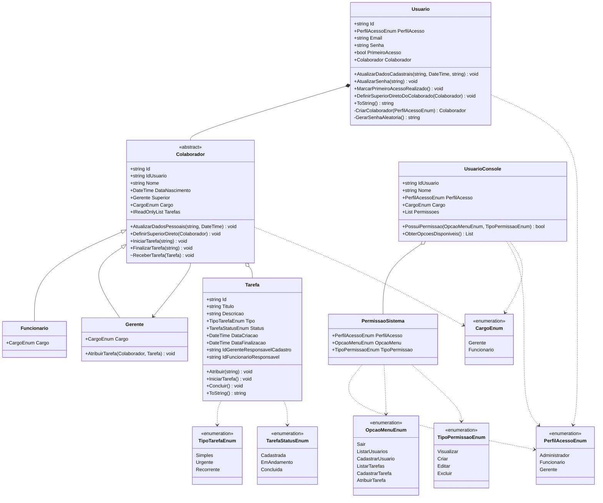

# Sistema de Tarefas

## 📁 Estrutura de Arquivos

```text
tarefas/
├── Enums/
│   ├── CargoEnum.cs
│   ├── OpcaoMenuEnum.cs
│   ├── PerfilAcessoEnum.cs
│   ├── TarefaStatusEnum.cs
│   ├── TipoPermissaoEnum.cs
│   └── TipoTarefaEnum.cs
│
├── Handlers/
│   ├── TarefaHandler.cs
│   └── UsuarioHandler.cs
│
├── Helpers/
│   └── EnumHelper.cs
│
├── Mock/
│   ├── PermissaoFactory.cs
│   └── UsuarioFactory.cs
│
├── Models/
│   ├── Colaborador.cs          (abstrato)
│   ├── Funcionario.cs
│   ├── Gerente.cs
│   ├── PermissaoSistema.cs
│   ├── Tarefa.cs
│   ├── Usuario.cs
│   └── UsuarioConsole.cs
│
├── Services/
│   ├── LoginService.cs
│   └── TarefaService.cs
│
├── UI/
│   ├── AplicacaoUI.cs
│   ├── LoginUI.cs
│   └── MenuUI.cs
│
└── Program.cs
```

---

## 📐 Diagrama de Classes UML



---

## 🏗️ Arquitetura em Camadas

```text
┌─────────────────────────────────────┐
│              Program.cs             │  ← Inicializa listas e chama UI
└──────────────────┬──────────────────┘
                   │
┌──────────────────▼──────────────────┐
│               UI Layer              │
│  AplicacaoUI  LoginUI  MenuUI       │  ← Renderização e loops de tela
└──────────────────┬──────────────────┘
                   │
┌──────────────────▼──────────────────┐
│            Handlers Layer           │
│   UsuarioHandler   TarefaHandler    │  ← Leitura e validação de inputs
└──────────────────┬──────────────────┘
                   │
┌──────────────────▼──────────────────┐
│            Services Layer           │
│    LoginService    TarefaService    │  ← Regras de negócio
└──────────────────┬──────────────────┘
                   │
┌──────────────────▼──────────────────┐
│             Models Layer            │
│  Usuario  Colaborador  Tarefa  ...  │  ← Domínio da aplicação
└─────────────────────────────────────┘
```

---

## 🔐 Permissões por Perfil

| Opção de Menu     | Funcionário    | Gerente        | Administrador  |
|-------------------|:--------------:|:--------------:|:--------------:|
| Listar Tarefas    | ✅ Visualizar  | ✅ Visualizar  | ✅ Visualizar  |
| Cadastrar Tarefa  | ❌             | ✅ Criar       | ✅ Criar       |
| Atribuir Tarefa   | ❌             | ✅ Criar       | ✅ Criar       |
| Listar Usuários   | ❌             | ✅ Visualizar  | ✅ Visualizar  |
| Cadastrar Usuário | ❌             | ❌             | ✅ Criar       |
