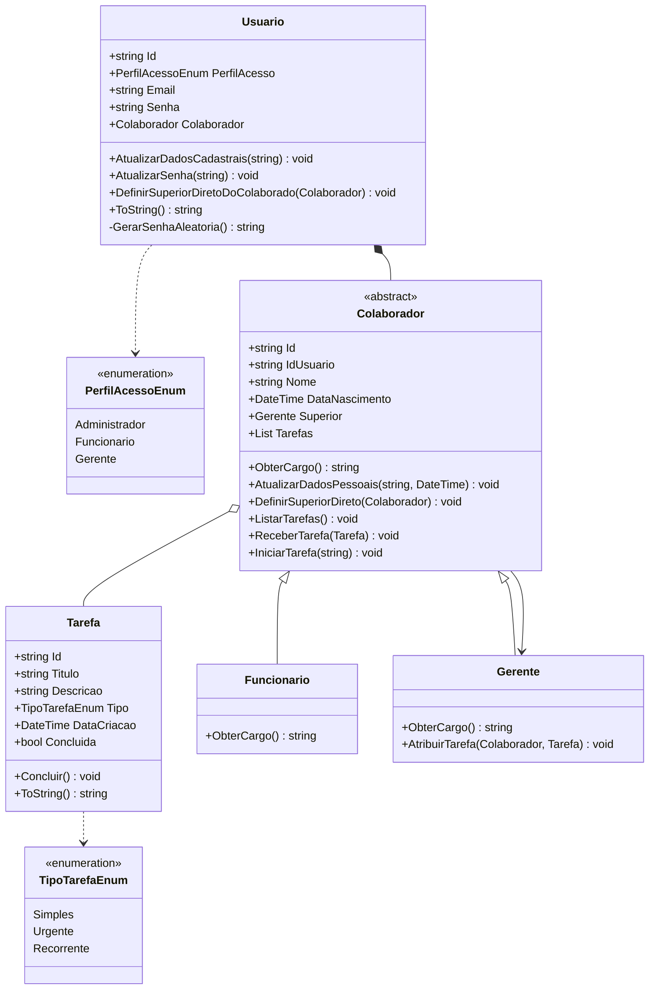

Revisando: Encapsulamento
    - modificadores de acesso para as propriedades da classe
    - Métodos são a forma que as classes se comportam
    - construtores para encapsular a logica de criação da classe 
    - Metodo GerarSenhaAleatoria() sendo chamado dentro do construtor para inicializar uma senha aleatoria quando o usuario for cadastrado
    - sobrecarga e sobrescrita de métodos

Composição: permite relação entre classes 
    todos os usuarios são colaboradores, o sistema não deve permitir que mais de um usuario seja criado para cada colaborador 

TODO: - Criar a classe Colaborador
    - irá definir o cargo -- talvez mais tarde
    - irá definir o superior direto daquele colaborador (autoRelacionamento)

tarefas/
├── Enums/
│   ├── PerfilAcessoEnum.cs
│   └── TipoTarefaEnum.cs       ← novo
├── Models/
│   ├── Colaborador.cs          ← refatorado (abstrato)
│   ├── Funcionario.cs          ← novo
│   ├── Gerente.cs              ← novo
│   ├── Tarefa.cs               ← novo
│   └── Usuario.cs              ← refatorado
└── Program.cs                  ← atualizado

